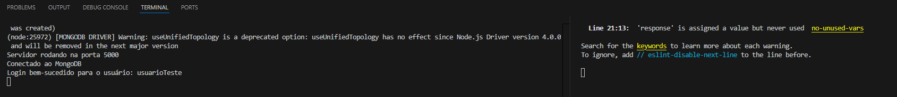

# Projeto Web Fullstack

Este é um projeto de aplicação web fullstack com front-end em React.js e back-end em Express.js, utilizando MongoDB para o banco de dados.

## Instruções para Executar o Projeto

1. Instalar e Rodar o Back-end

Acesse o diretório do back-end:

cd backend

Instale as dependências do back-end:

npm install

Inicie o servidor do back-end:

npm start

O servidor deve iniciar e escutar na porta configurada (a porta 5000).

3. Instalar e Rodar o Front-end

Abra uma nova janela do terminal ou prompt de comando.

Acesse o diretório do front-end. Certifique-se de estar na raiz do projeto ao executar este comando:

cd frontend

Instale as dependências do front-end:

npm install

Inicie o servidor do front-end:

npm start

O front-end deve iniciar e abrir automaticamente em um navegador, na porta 3000. Caso contrário, acesse http://localhost:3000 no navegador.

4. Configurar o Banco de Dados

Certifique-se de que o MongoDB está instalado e em execução. Caso não tenha, siga as instruções para instalar e iniciar o MongoDB.

Verifique se a URL do MongoDB no arquivo de configuração (server.js do back-end) está correta. O arquivo server.js deve conter uma linha semelhante a esta para conectar ao MongoDB:

const dbUri = 'mongodb://localhost:27017/projeto3-db';

5. Testar o Projeto

No navegador, acesse a aplicação front-end que está rodando em http://localhost:3000.

##### USUARIO PARA TESTE #####

Usuario: usuarioTeste

Senha: senhaSegura123

Teste as funcionalidades da aplicação, como o login e a busca de versículos, para garantir que tudo está funcionando conforme esperado.

6. Verificar Logs e Erros

Observe os logs no terminal onde o back-end e o front-end estão rodando para identificar quaisquer erros ou problemas.

